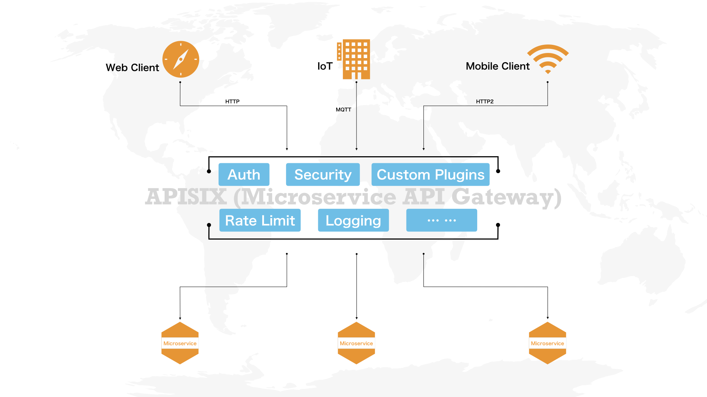

APISIX is a cloud-native microservices API gateway, delivering the ultimate performance, security, open source and scalable platform for all your APIs and microservices.
APISIX is based on Nginx and etcd. Compared with traditional API gateways, APISIX has dynamic routing and plug-in hot loading, which is especially suitable for API management under micro-service system.

## Why APISIX?

If you are building a website, mobile device or IoT (Internet of Things) application, you may need to use an API gateway to handle interface traffic.

APISIX is a cloud-based microservices API gateway that handles traditional north-south traffic and handles east-west traffic between services, and can also be used as a k8s ingress controller.

APISIX provides dynamic load balancing, authentication, rate limiting, other plugins through plugin mechanisms, and supports plugins you develop yourself.

## Features
You can use Apache APISIX as a traffic entrance to process all business data, including dynamic routing, dynamic upstream, dynamic certificates,
A/B testing, canary release, blue-green deployment, limit rate, defense against malicious attacks, metrics, monitoring alarms, service observability, service governance, etc.

- **All platforms**
    - Cloud-Native: Platform agnostic, No vendor lock-in, APISIX can run from bare-metal to Kubernetes.
    - Run Environment: Both OpenResty and Tengine are supported.
    - Supports ARM64: Don't worry about the lock-in of the infra technology.

- **Multi protocols**
    - TCP/UDP Proxy]: Dynamic TCP/UDP proxy.
    - Dynamic MQTT Proxy: Supports to load balance MQTT by `client_id`, both support MQTT [3.1.*](http://docs.oasis-open.org/mqtt/mqtt/v3.1.1/os/mqtt-v3.1.1-os.html), [5.0](https://docs.oasis-open.org/mqtt/mqtt/v5.0/mqtt-v5.0.html).
    - gRPC proxy]: Proxying gRPC traffic.
    - gRPC transcoding: Supports protocol transcoding so that clients can access your gRPC API by using HTTP/JSON.
    - Proxy Websocket
    - Proxy Protocol
    - Proxy Dubbo: Dubbo Proxy based on Tengine.
    - HTTP(S) Forward Proxy
    - SSL: Dynamically load an SSL certificate.

- **Full dynamic**
    - Hot Updates And Hot Plugins: Continuously updates its configurations and plugins without restarts!
    - Proxy Rewrite: Support rewrite the `host`, `uri`, `schema`, `enable_websocket`, `headers` of the request before send to upstream.
    - Response Rewrite: Set customized response status code, body and header to the client.
    - Serverless: Invoke functions in each phase in APISIX.
    - Dynamic Load Balancing: Round-robin load balancing with weight.
    - Hash-based Load Balancing: Load balance with consistent hashing sessions.
    - Health Checks: Enable health check on the upstream node, and will automatically filter unhealthy nodes during load balancing to ensure system stability.
    - Circuit-Breaker: Intelligent tracking of unhealthy upstream services.
    - Dynamic service discovery：Support service discovery based on registry, reduce the reverse proxy maintenance costs.

- **Fine-grained routing**
    - Supports full path matching and prefix matching
    - Support all Nginx built-in variables as conditions for routing, so you can use `cookie`,` args`, etc. as routing conditions to implement canary release, A/B testing, etc.
    - Support various operators as judgment conditions for routing, for example `{"arg_age", ">", 24}`
    - Support custom route matching function
    - IPv6: Use IPv6 to match route.
    - Support [TTL](doc/admin-api-cn.md#route)
    - [Support priority](doc/router-radixtree.md#3-match-priority)
    - [Support Batch Http Requests](doc/plugins/batch-requests.md)

- **Security**
    - Authentications: [key-auth](doc/plugins/key-auth.md), [JWT](doc/plugins/jwt-auth.md), [basic-auth](doc/plugins/basic-auth.md), [wolf-rbac](doc/plugins/wolf-rbac.md)
    - [IP Whitelist/Blacklist](doc/plugins/ip-restriction.md)
    - [IdP](doc/plugins/oauth.md): Support external authentication services, such as Auth0, okta, etc., users can use this to connect to OAuth 2.0 and other authentication methods.
    - [Limit-req](doc/plugins/limit-req.md)
    - [Limit-count](doc/plugins/limit-count.md)
    - [Limit-concurrency](doc/plugins/limit-conn.md)
    - Anti-ReDoS(Regular expression Denial of Service): Built-in policies to Anti ReDoS without configuration.
    - [CORS](doc/plugins/cors.md)

- **OPS friendly**
    - OpenTracing: support [Apache Skywalking](doc/plugins/skywalking.md) and [Zipkin](doc/plugins/zipkin.md)
    - Monitoring And Metrics: [Prometheus](doc/plugins/prometheus.md)
    - Clustering: APISIX nodes are stateless, creates clustering of the configuration center, please refer to [etcd Clustering Guide](https://github.com/etcd-io/etcd/blob/master/Documentation/op-guide/clustering.md).
    - High availability: support to configure multiple etcd addresses in the same cluster.
    - Dashboard: Built-in dashboard to control APISIX.
    - Version Control: Supports rollbacks of operations.
    - CLI: start\stop\reload APISIX through the command line.
    - [Stand-alone mode](doc/stand-alone.md): Supports to load route rules from local yaml file, it is more friendly such as under the kubernetes(k8s).
    - [Global Rule](doc/architecture-design.md#Global-Rule): Allows to run any plugin for all request, eg: limit rate, IP filter etc.
    - High performance: The single-core QPS reaches 18k with an average delay of less than 0.2 milliseconds.
    - [Fault Injection](doc/plugins/fault-injection.md)
    - [REST Admin API](doc/admin-api.md): Using the REST Admin API to control Apache APISIX, which only allows 127.0.0.1 access by default, you can modify the `allow_admin` field in `conf/config.yaml` to specify a list of IPs that are allowed to call the Admin API. Also note that the Admin API uses key auth to verify the identity of the caller. **The `admin_key` field in `conf/config.yaml` needs to be modified before deployment to ensure security**.
    - External Loggers: Export access logs to external log management tools. ([HTTP Logger](doc/plugins/http-logger.md), [TCP Logger](doc/plugins/tcp-logger.md), [Kafka Logger](doc/plugins/kafka-logger.md), [UDP Logger](doc/plugins/udp-logger.md))

- **Highly scalable**
    - [Custom plugins](doc/plugin-develop.md): Allows hooking of common phases, such as `rewrite`, `access`, `header filer`, `body filter` and `log`, also allows to hook the `balancer` stage.
    - Custom load balancing algorithms: You can use custom load balancing algorithms during the `balancer` phase.
    - Custom routing: Support users to implement routing algorithms themselves.
